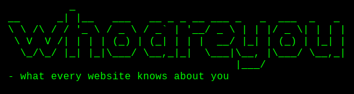

## whoareyou - what every website knows about you

The whoareyou website mimics a terminal interface, allowing users to run the 'whoami' command to see what information websites can access about them. It was made to raise awareness about all the data that websites can collect about you.

## Acknowledgements
Thanks to the original [webkay website](https://webkay.robinlinus.com/) by Robin Linus for inspiration.

## License
This project is licensed under the MIT License. Read more about it [here](./LICENSE)